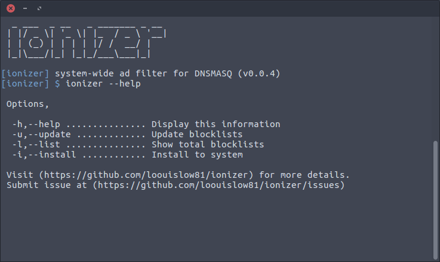
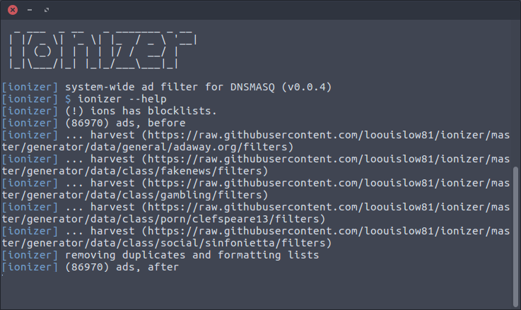

# ionizer v0.0.3

<p align="left">
  
  
  
  
  
  
  
  
  
  
  
  
</p>

System-wide ads filter with just `DNSMASQ` and `BASH` for Linux.

This is my daily use mini tool for all my Linux computers. Blocking ads works seamlessly amazing than installing web browser extensions and desktop apps.

<p align="left">
  
  
</p>


#### __usage

**(!!)** May required root permissions.

edit file `/etc/dnsmasq.conf` and add this line,

```bash
...
addn-hosts=/etc/ionizer/ipaddress.ions
...
```

install and update the blocklists, ionizer will install `dnsmasq` for you if not installed,

```bash
$ ionizer --install
$ ionizer --update
```

**Note:** you can add `ionizer --update` into `crontab` to automate the blocklist updates.

CLI options,

```bash
-h,--help ............... Display this information
-u,--update ............. Update blocklists
-l,--list ............... Show total blocklists
-i,--install ............ Install to system
```

Enjoy!

---

[MIT](https://github.com/loouislow81/ionizer/blob/master/LICENSE)
